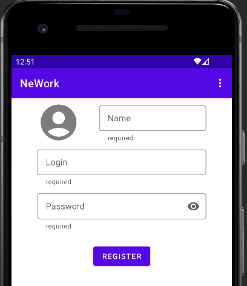
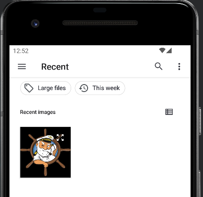
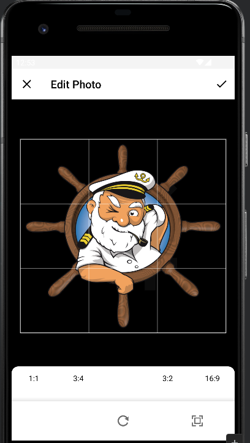
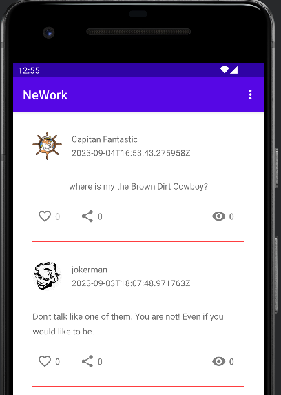

# Дипломная работа по профессии Android Developer

## Приложение NeWork

### В приложении будут реализованы функции:
1. Авторизация:
   - Регистрация пользователя с указанием имени, логина, пароля и выбором аватара;
   - Вход по логину и паролю;
   - Выход.
2. Просмотр списка пользователей.
3. Просмотр профиля пользователя, выбранного в списке.
4. Редактирование профиля текущего пользователя.
   - Профиль помимо имени, логина, пароля и аватара должен содержать список работ, постов и событий пользователя с возможностью добавления новых, удаления и редактирования существующих элементов в каждом из списков.
5. Просмотр списка постов всех пользователей. 
   - Авторизованному пользователю доступны действия в списке: 
     - установка лайка для выбранного поста;
     - прослушивание аудио и просмотр видео выбранного поста.
     - просмотр списка пользователей, поставивших лайк. 
6. Добавление поста авторизованным пользователем.
   - пост может содержать: текст, внешняя ссылку, изображение, аудио с возможностью прослушивания и видео с возможность просмотра.
7. Редактирование и удаление своего поста авторизованным пользователем.
8. Просмотр списка событий.
   - Авторизованному пользователю доступны действия в списке: 
     - установка лайка для выбранного события;
     - прослушивание аудио и просмотр видео выбранного события;
     - просмотр списка пользователей, поставивших лайк.
9.  Добавление события авторизованным пользователем.
    - событие может содержать текст, внешняя ссылка, аудио, видео, список участников, список докладчиков
10. Реактирование и удаление своих событий авторизованным пользователем.

Приложение будет создано на базе разработанного в процессе обучения приложения NMedia. В нем будут применены технологии, используемые в процессе обучения:
- архитектура MVVM;
- взаимодействие с базой данных (библиотека ROOM);
- сетевое взаимодействие с сервером (библиотека Retrofit);
- пагинация при работе со списками данных (библиотека PAGING 3);
- управление зависимостями (библиотека Dagger HILT)

С учетом этого:
## План выполнения:

1. Добавить функцию регистрации пользователя (функции авторизации: вход и выход уже имеются);
   Срок: 29.08.2023 - 31.08.2023
2. Доработать существующий функционал работы с постами с учетом изменившейся структуры базы данных и добавлением возможности работы с мультимедиа (аудио, видео);
   Срок: 01.09.2023 - 03.09.2023
3. Добавить функционал работы со списком пользователей;
   Срок: 04.09.2023 - 07.09.2023
4. Добавить функционал работы с профилем пользователя и списком работ;
   Срок: 08.09.2023 - 10.09.2023
5. Добавить функционал работы с событиями.
   Срок: 11.09.2023 - 13.09.2023
6. Сдача работы
   Срок: 14.09.2023 - 19.09.2023

## Выполнено:

### 04.09.2023
- Настроена CI для проекта;
- Настроен частично просмотр списка постов для работы с новым сервером (пока нет просмотра видео и прослушиания аудио, но есть показ аватаров и вложенных картинок);
- Добавлена функция регистрации пользователя с возможностью выбора аватара.
  
Последовательность работы с регистрацией:

1. После выбора пункта меню "Registration" в верхнем меню, вызываемом при нажатии на кнопку "три точки", на экране появляется форма регистрации пользователя:

2. При нажатии на иконку аватара появляется форма выбора файла картинкаи:

3. После выбора картинки пояляется форма редактирования картинки:

4. Подтверждаем изменения кнопкой V в верхней панели и в форме регистрации заполняем поля имени, логина и пароля (все обязательны для ввода):
   
   

5. Выполняем регистрацию пользователя нажав кнопку "Register", после чего открывается список постов, где можно создавать посты от имени зарегистрированного пользователя:

