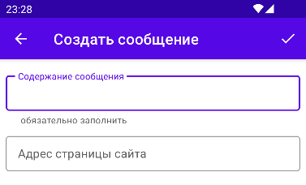
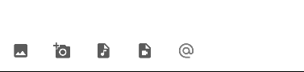

# Дипломная работа по профессии Android Developer

## Приложение NeWork

### В приложении будут реализованы функции:
1. Авторизация:
   - Регистрация пользователя с указанием имени, логина, пароля и выбором аватара;
   - Вход по логину и паролю;
   - Выход.
2. Просмотр списка пользователей.
3. Просмотр профиля пользователя, выбранного в списке.
4. Редактирование профиля текущего пользователя.
   - Профиль помимо имени, логина, пароля и аватара должен содержать список работ, постов пользователя с возможностью добавления новых, удаления и редактирования существующих элементов в каждом из списков.
5. Просмотр списка постов всех пользователей. 
   - Авторизованному пользователю доступны действия в списке: 
     - установка лайка для выбранного поста;
     - прослушивание аудио и просмотр видео выбранного поста.
     - просмотр списка пользователей, поставивших лайк. 
6. Добавление поста авторизованным пользователем.
   - пост может содержать: текст, внешняя ссылку, изображение, аудио с возможностью прослушивания и видео с возможность просмотра.
7. Редактирование и удаление своего поста авторизованным пользователем.
8. Просмотр списка мероприятий.
   - Авторизованному пользователю доступны действия в списке: 
     - установка лайка для выбранного мероприятия;
     - прослушивание аудио и просмотр видео выбранного мероприятия;
     - просмотр списка пользователей, поставивших лайк.
9.  Добавление мероприятия авторизованным пользователем.
    - мероприятие может содержать текст, внешняя ссылка, аудио, видео, список участников, список докладчиков
10. Реактирование и удаление своих мероприятий авторизованным пользователем.

Приложение будет создано на базе разработанного в процессе обучения приложения NMedia. В нем будут применены технологии, используемые в процессе обучения:
- архитектура MVVM;
- взаимодействие с базой данных (библиотека ROOM);
- сетевое взаимодействие с сервером (библиотека Retrofit);
- пагинация при работе со списками данных (библиотека PAGING 3);
- управление зависимостями (библиотека Dagger HILT)

## Реализовано:

## 1. Навигация
  
1.1 В левом углу верхней панели приложения расположена кнопка "Сендвич", при нажатии на которую появляется меню навигации:

Меню позволяет перейти к соответствующему разделу приложения.

1.2. В правом углу верхней панели приложения расположена кнопка "Три точки", которая вызывает меню авторизации.
Если пользователь не авторизовался, меню содержит два пункта: 

1.2.1 Войти - позволяет пользователю авторизоваться путем ввода логина и пароля:

1.2.2 Регистрация - позволяет зарегистировать нового пользователя:

Аватар пользователя можно выбрать нажав на иконку пользоватля. 
Поля логин и пароль обязательны для заполнения.

1.2.3 Если пользователь авторизовался, то в меню присутствует один пункт - "Выйти", при выборе которого авторизация текущего пользователя прекращается.

## 2. Разделы приложения

### Сообщения

Экран "Сообщения" содержит список сообщений пользователей:

Каждое сообщение содержит:
- аватар и имя автора
- дату и время создания сообщения
- текст сообщения
- ссылка на страницу сайта (может не быть)
- вложение в виде картинки, аудио записи или видео (может не быть)
- Счетчик отметок "Нравится"
- кнопка "Нравится" (сердечко)
- кнопка "Упомянутые пользователи" (@) и счетчик этих пользователей 
(подсвечивается зеленым, если есть упомянутые пользователи, красным, если авторизоанный пользователь в списке упомянутых пользователей)

Если указана ссылка на страницу сайта, при нажатии на нее будет открыта странница сайта в веб браузере.

При нажатии на надпись "Нравится" в случае, если пост оценен пользователями, будет показан экран со списком этих пользователей:

Если нажать на карточку пользователя на этом экране, будет показан экран профиля пользователя (экран профиля будет рассмотрен ниже).

При нажатии на кнопку "@" в случае, если в сообщении есть упомянутые пользователи, то будет показан экран со списком этих пользователей.

Нажатие на кнопку сердечко доступно только авторизованному пользователю. 
Если пользователь авторизован, то при нажатии на эту кнопку в случае, если он ранее не оценил этот пост, кнопка становится красной и счетчик "Нравится" увеличивается на единицу. Если пользователь ранее оценил пост, то кнопка становится серой и счетчик "Нравится" уменьшается на единицу.

При нажатии на вложение будет показан экран просмотра вложения, который позволяет просмартивать картинки, прослушивать аудио записи и просматривать видео:

#### Создание нового сообщения

Создать сообщение может только авторизованный пользователь при нажатию на кнопку создания сообщения ("+") в правом нижнем углу экрана сообщений:

Если пользователь не авторизован, то в нижней части экрана выдается сообщение с предложением авторизоваться.
При нажатии на кнопку создания нового сообщения авторизованным пользователем будет показан экран:

Обязательным для заполнения является поле "Содержание сообщения".
В поле "Адрес страницы сайта" можно ввести web адрес.
В нижней части экрана расположена панель с кнопками выбора вложения и выбора упоминаемых пользователей.
Кнопки слева на право:
- выбор картинки
- выбор фотографии
- выбор аудио трека
- выбор видео
- выбор упоминаемых пользоваталей.

При нажатии на кнопку выбора упоминаемых пользователей показывается экран выбора пользователей:

На этом экране есть поле поиска/фильтра, при вводе текста в которое производится отбор пользователей по наличию введенного текста в наименовании пользователя.
При нажатии на карточку пользователя карточка помечается флагом (справа в карточке пользователя), либо пометка снимается, если ранее он уже был помечен.
Добавление отмеченных пользователей производится кнопкой V в правой части верхней панели экрана, отмена добавления - кнопкой "влево" в левой части панели.
Если ранее в карточку нового сообщения были добавлены упоминаемые пользователи, то удалить их из списка можно вызвав снова экран выбора пользователей и, не отметив ни одного, нажать кнопку V.

Сохранение сообщения производится нажатием кнопки V справа в верхней панели экрана.
Нажатие кнопки "влево" в левой части верхней панели экрана возвращает к предыдущему экрану без сохранения сообщения.

#### Редактирование сообщения

Редактировать сообщение может только авторизованный пользователь, если он является автором этого сообщения.
На возможность редактирования сообщения указывает кнопка "три точки" в правом верхнем углу сообщения.
При нажатии кнопки появляется меню из двух пунктов:
- Редактировать
- Удалить.

При выборе пункта "Редактировать" будет показан экран изменения сообщения:

При выборе пункта "Удалить" сообщение будет удалено.

Кнопки нижней панели экрана изменения сообщения и их назначение такие же как на экране создания сообщения.
Сохранение сообщения или отмена сохранения изменений производится также как на экране создания сообщения.

### Пользователи

При выборе этого раздела показывается экран пользователей, зарегистрированных в приложении:

Поиск/фильтрация на этом экране работает также, как описано ранее на экранах создания и редактирования сообщения при добавлении упоминаемых сотрудников.

При нажатии на карточку пользователя показывается экран профиля пользователя:

На экране расположены два переключаемых списка:
- места работы - содержит список упорядоченных по дате мест работы пользователя
- сообщения - содержит сообщения, созданные пользователем:

### Мероприятия

Экран "Мероприятия" содержит список мероприятий, объявленных пользователями:

Каждое мероприятие содержит:
- аватар и имя автора
- дату и время создания мероприятия
- текст объявления о мероприятия
- дату и время проведения мероприятия
- ссылка на страницу сайта (может не быть)
- вложение в виде картинки, аудио записи или видео (может не быть)
- Счетчик отметок "Нравится"
  Кнопки слева направо:
- кнопка "Нравится" (сердечко)
- кнопка и счетчик участников (подсвечивается зеленым, если есть участники и красным, если участвует текущий авторизованный пользователь)
- кнопка "Участвовать" (меняет пиктограмму, если участвуешь или нет)
- кнопка и счетчик докладчиков (подсвечивается зеленым, если есть участники)

Если указана ссылка на страницу сайта, при нажатии на нее будет открыта странница сайта в веб браузере.

Нажатие на кнопку "Участвовать" доступно только авторизованному пользователю
При нажатии на эту кнопку авторизованным пользователем в случае, если этот пользователь не заявлял об участии, то он будет добавлен в список участников, а счетчик участников увеличится на 1. Если пользователь есть в списке участников нажатие на эту кнопку удалит его из списка участников и уменьшит счетчик участников.

Нажатие на кнопку "Нравится" (сердечко) для мероприятий работает так же, как для сообщений.
Нажатие на надпись счетчика "Нравится" и кнопки участников и докладчиков работают так же, как в сообщении (выводят список пользователей).

#### Создание нового мероприятия

Создать мероприятие может только авторизованный пользователь, нажав на кнопку создания сообщения ("+") в правом нижнем углу экрана мероприятий.
Если пользователь не авторизован, то в нижней части экрана выдается сообщение с предложением авторизоваться.

При нажатии на кнопку создания нового мероприятия авторизованным пользователем будет показан экран:

Обязательным для заполнения являются поля:
- Формат проведения - выпадающий список из двух вариантов "Автономно" и "В сети" (по умолчанию выбран вариант "Автономно")
- Описание мероприятия
- Дата проведения
- Время проведения
Поле "Адрес страницы сайта" не является обязательным для заполнения, в него можно ввести web адрес.
В нижней части экрана расположена панель с кнопками выбора вложения и выбора докладчиков.
Кнопки слева на право:
- выбор картинки
- выбор фотографии
- выбор аудио трека
- выбор видео
- выбор докладчиков.

Выбор значения поля "Дата проведения" производится с помощью календаря:

Выбор значения поля "Время проведения" производится с помощью диалога выбора времени:

При нажатии на кнопку выбора докладчиков показывается экран выбора пользователей аналогично как на экране создания сообщения.
Остальные кнопки нижней панели работают аналогично кнопкам экрана создания/редактирования сообщения.

Сохранение мероприятия производится нажатием кнопки V справа в верхней панели экрана.
Нажатие кнопки "влево" в левой части верхней панели экрана возвращает к предыдущему экрану без сохранения мероприятия.

#### Редактирование мероприятия

Редактировать мероприятие может только авторизованный пользователь, если он объявил это мероприятие.
На возможность редактирования сообщения указывает кнопка "три точки" в правом верхнем углу мероприятия.
При нажатии кнопки появляется меню из двух пунктов:
- Редактировать
- Удалить.

При выборе пункта "Редактировать" будет показа экран изменения сообщения:

При выборе пункта "Удалить" мероприятие будет удалено.

Выбор значений полей "Дата проведения" и "Время проведения" выполняется так же, как на экране создания мероприятия.
Кнопки нижней панели экрана и их назначение такие же, как на экране создания мероприятия.

Сохранение сообщения или отмена сохранения изменений производится так же, как на экране создания мероприятия.

### Профиль

При выборе этого раздела показывается экран профиля авторизоанного пользователя. 
Если пользователь не авторизован, внизу экрана будет сообщение с приглашением авторизоваться.

Экран профиля пользователя описан ранее.

#### Создание места работы

В списке "Места работы" можно создать новое место работы, нажав кнопку "+" в правом нижнем углу списка мест работы.
При этом показывается экран создания места работы:

На этом экране необходимо заполнить обязательные поля:
- Наименование компании
- Наименование должности
- Дата начала

Поля Дата окончания и Адрес сайта необязательные для заполнения.
Данные в поля дат вводятся с помощью календаря.

Сохранение места работы или отмена сохранения изменений производится так же, как на экране создания сообщения.

#### Редактирование места работы

Редактирование и удаление места работы производится при выборе пункта меню по нажатию кнопки "три точки" в правом верхнем углу места работы.

При выборе пункта "Редактировать" показывается экран изменения места работы:

Сохранение места работы или отмена сохранения изменений производится так же, как на экране создания места работы.

#### Список "Сообщения"

Список сообщений содержит сообщения опубликованные текущим авторизованным пользователем.
Просмотр, создание и редактирование сообщений этого списка производится аналогично тому, как это делается в разделе "Сообщения". 

### О программе

При выборе этого раздела показывается диалоговое окно, содержащее сведения о приложении:

